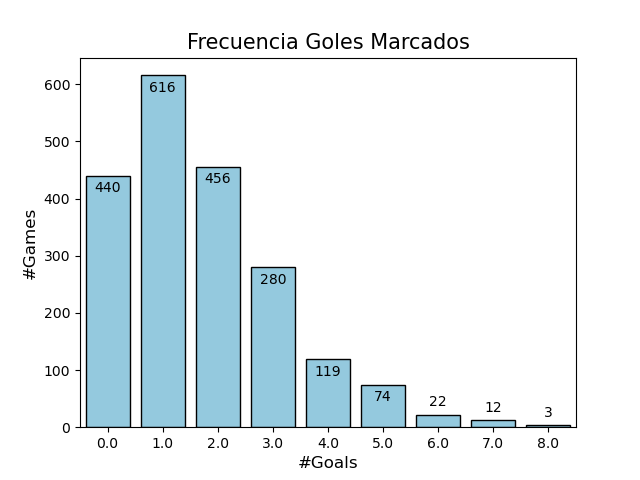
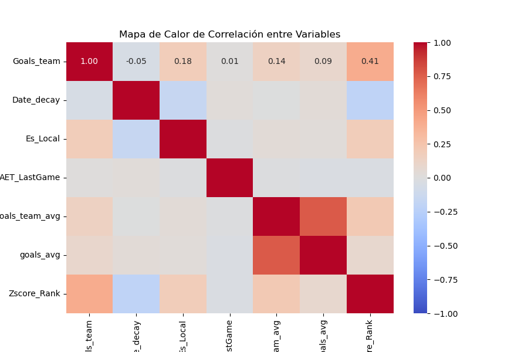

# 🏆 World Cup 2026 Goal Predictor

Un enfoque estadístico basado en Regresión de Poisson para la predicción de resultados en el Mundial 2026.

## 📝 Visión General
Este proyecto nace de la necesidad de cuantificar el rendimiento ofensivo y defensivo de las selecciones nacionales utilizando datos históricos. La metodología integra técnicas de web scraping avanzado, ingeniería de características (feature engineering) y modelado estadístico para estimar la probabilidad de goles por partido.


## Predicción de Goles para el Mundial 2026

Este proyecto desarrolla un modelo predictivo basado en Regresión de Poisson para estimar la cantidad de goles en partidos de fútbol, utilizando datos históricos desde el Mundial de Qatar 2022.

### Características Principales

1. Web Scraping: Extracción automatizada de resultados desde Wikipedia.
2. Normalización de tipos de torneo (Amistosos, Eliminatorias, Torneos Continentales).
3. Integración con Rankings FIFA.
4. Modelado: Regresión de Poisson para eventos de conteo.

## 🛠️ Metodología Técnica
El proceso está diseñado para ser escalable y modular:

**Adquisición de Datos (Scraping)**: Implementación de una arquitectura de extracción robusta utilizando BeautifulSoup y requests, superando la inconsistencia estructural de las tablas en Wikipedia.

**Limpieza y Normalización**: Transformación de datos desestructurados en una base relacional. Se incluyen procesos de estandarización de fechas y normalización de categorías de partidos (Amistosos vs. Torneos Oficiales).

**Ingeniería de Características**: Creación de variables clave como forma reciente con decaimiento exponencial (dando más peso a los últimos partidos) y rankings FIFA.

**Modelado**: Aplicación de Regresión de Poisson, un modelo ideal para modelar eventos de conteo independientes en fútbol.

## 🚀 Flujo de Trabajo

01_WebScrapping.ipynb: Extracción automatizada.

02_Model_Prediction.ipynb: Transformación, entrenamiento y evaluación del modelo.

utils.py: Módulo de funciones core para limpieza y validación.

## 🧠 Enfoque Metodológico: 
**Selección del modelo:** Se ha seleccionado la Regresión de Poisson debido a la naturaleza discreta y positiva de los datos (la cantidad de goles en un partido es un número entero no negativo). A diferencia de una regresión lineal tradicional, el modelo de Poisson respeta la distribución estadística real de los goles y evita predicciones imposibles (como goles negativos).

**Selección de Variables (Feature Engineering):**
El modelo se alimenta de variables transformadas para capturar la dinámica competitiva sin depender de factores externos subjetivos:

`goals_team`: Variable respuesta a modelar. 

`goals_team_avg`: Promedio de goles anotados por el equipo en los últimos 5 partidos. 

`goals_avg`: Promedio de goles totales (propios + rivales) en los últimos 5 partidos.

`Date_decay`: Se ha aplicado un factor de decaimiento para otorgar mayor relevancia estadística a los partidos más recientes, asumiendo que el rendimiento actual es un predictor más fiable que el desempeño de hace dos años.

`Game_type`: Categoría de Partido (Amistoso, Eliminatoria, Torneo Continental, Copa del Mundo) utilizada para ponderar la competitividad de los datos históricos.

`Es_Local`: Variable binaria que identifica si el equipo participa en condición de local.

`AET_LastGame`: Variable binaria que identifica si en el partido anterior hubo alargue (AET - Added Extra Time).

`Zscore_Rank`: diferencia estandarizada (media=0, varianza=1) entre el puntaje FIFA del equipo con el oponente.

`Weight`: Peso que tiene el partido según tipo de competición (0.8 Copa del Mundo, 0.6 Clasificatorias, 0.6 Copas de Federaciones, 0.5 Nations League, 0.4 Amistoso & Otros)

## 📊 Resultados y Visualizaciones

**N de goles:** Variable respuesta discreta. Se observa una mayor concentración con menores valores, similar a una distribución Poisson.



**Correlacción:** Validación de que las variables independientes no presenten multicolinealidad, garantizando que el modelo sea estable.



No se observa una alta correlación entrea las variables respuesta  y las variables independientes.

**Modelo Estadístico:** Entre las opciones disponibles, se optó por el siguiente modelo, usando `Weight` como variable de ponderación en cada partido:

```
Generalized Linear Model Regression Results                  
==============================================================================
Dep. Variable:             Goals_team   No. Observations:                 2022
Model:                            GLM   Df Residuals:                     2018
Model Family:                 Poisson   Df Model:                            3
Link Function:                    Log   Scale:                          1.0000
Method:                          IRLS   Log-Likelihood:                -3218.2
Date:               lun, 22 jun. 2026   Deviance:                       2390.7
Time:                        14:02:26   Pearson chi2:                 2.10e+03
No. Iterations:                     5   Pseudo R-squ. (CS):             0.1919
Covariance Type:            nonrobust                                         
==================================================================================
                     coef    std err          z      P>|z|      [0.025      0.975]
----------------------------------------------------------------------------------
Intercept          0.3508      0.042      8.425      0.000       0.269       0.432
Date_decay         0.1689      0.096      1.756      0.079      -0.020       0.357
Zscore_Rank        0.3609      0.019     19.135      0.000       0.324       0.398
goals_team_avg     0.0548      0.020      2.752      0.006       0.016       0.094
==================================================================================
```

**Performance del modelo:** El modelo presenta el error de predicción de `Error promedio: 1.04 goles por partido` usando los partidos anteriores. 

Se puede usar la predicción de los próximos partidos para configurar una métrica de desempeño real del modelo.

**Pronóstico Próximos Partidos:** Los goles que el modelo predice para los siguientes partidos del mundial son los siguientes:

| Date       | Team   | Opponent                         |   Goles_Estimados |
|:-----------|:-------|:---------------------------------|------------------:|
| 2026-06-22 | ALG    | Jordan                           |                 2 |
| 2026-06-22 | ARG    | Austria                          |                 2 |
| 2026-06-22 | AUT    | Argentina                        |                 1 |
| 2026-06-22 | FRA    | Iraq                             |                 3 |
| 2026-06-22 | IRQ    | France                           |                 1 |
| 2026-06-22 | JOR    | Algeria                          |                 1 |
| 2026-06-22 | NOR    | Senegal                          |                 1 |
| 2026-06-22 | SEN    | Norway                           |                 2 |
| 2026-06-23 | COD    | Colombia                         |                 1 |
| 2026-06-23 | COL    | Democratic Republic of the Congo |                 2 |
| 2026-06-23 | CRO    | Panama                           |                 2 |
| 2026-06-23 | ENG    | Ghana                            |                 3 |
| 2026-06-23 | GHA    | England                          |                 1 |
| 2026-06-23 | PAN    | Croatia                          |                 1 |
| 2026-06-23 | POR    | Uzbekistan                       |                 2 |
| 2026-06-23 | UZB    | Portugal                         |                 1 |
| 2026-06-24 | BIH    | Qatar                            |                 1 |
| 2026-06-24 | BRA    | Scotland                         |                 2 |
| 2026-06-24 | CAN    | Switzerland                      |                 1 |
| 2026-06-24 | CZE    | Mexico                           |                 1 |
| 2026-06-24 | HAI    | Morocco                          |                 1 |
| 2026-06-24 | KOR    | South Africa                     |                 2 |
| 2026-06-24 | MAR    | Haiti                            |                 3 |
| 2026-06-24 | MEX    | Czech Republic                   |                 2 |
| 2026-06-24 | QAT    | Bosnia and Herzegovina           |                 1 |
| 2026-06-24 | RSA    | South Korea                      |                 1 |
| 2026-06-24 | SCO    | Brazil                           |                 1 |
| 2026-06-24 | SUI    | Canada                           |                 2 |
| 2026-06-25 | AUS    | Paraguay                         |                 2 |
| 2026-06-25 | CIV    | Curaçao                          |                 2 |
| 2026-06-25 | CUW    | Ivory Coast                      |                 1 |
| 2026-06-25 | ECU    | Germany                          |                 1 |
| 2026-06-25 | GER    | Ecuador                          |                 2 |
| 2026-06-25 | JPN    | Sweden                           |                 2 |
| 2026-06-25 | NED    | Tunisia                          |                 2 |
| 2026-06-25 | PAR    | Australia                        |                 1 |
| 2026-06-25 | SWE    | Japan                            |                 1 |
| 2026-06-25 | TUN    | Netherlands                      |                 1 |
| 2026-06-25 | TUR    | United States                    |                 1 |
| 2026-06-25 | USA    | Turkey                           |                 2 |
| 2026-06-26 | BEL    | New Zealand                      |                 3 |
| 2026-06-26 | CPV    | Saudi Arabia                     |                 1 |
| 2026-06-26 | EGY    | Iran                             |                 1 |
| 2026-06-26 | ESP    | Uruguay                          |                 2 |
| 2026-06-26 | FRA    | Norway                           |                 2 |
| 2026-06-26 | IRN    | Egypt                            |                 2 |
| 2026-06-26 | IRQ    | Senegal                          |                 1 |
| 2026-06-26 | KSA    | Cape Verde                       |                 1 |
| 2026-06-26 | NOR    | France                           |                 1 |
| 2026-06-26 | NZL    | Belgium                          |                 1 |
| 2026-06-26 | SEN    | Iraq                             |                 2 |
| 2026-06-26 | URU    | Spain                            |                 1 |
| 2026-06-27 | ALG    | Austria                          |                 1 |
| 2026-06-27 | ARG    | Jordan                           |                 3 |
| 2026-06-27 | AUT    | Algeria                          |                 2 |
| 2026-06-27 | COD    | Uzbekistan                       |                 1 |
| 2026-06-27 | COL    | Portugal                         |                 1 |
| 2026-06-27 | CRO    | Ghana                            |                 2 |
| 2026-06-27 | ENG    | Panama                           |                 2 |
| 2026-06-27 | GHA    | Croatia                          |                 1 |
| 2026-06-27 | JOR    | Argentina                        |                 1 |
| 2026-06-27 | PAN    | England                          |                 1 |
| 2026-06-27 | POR    | Colombia                         |                 1 |
| 2026-06-27 | UZB    | Democratic Republic of the Congo |                 1 |

## 🛠️ Tecnologías Utilizadas
**Lenguaje**: Python

**Librerías**: pandas, numpy, scikit-learn, statsmodels (para Poisson), beautifulsoup4.